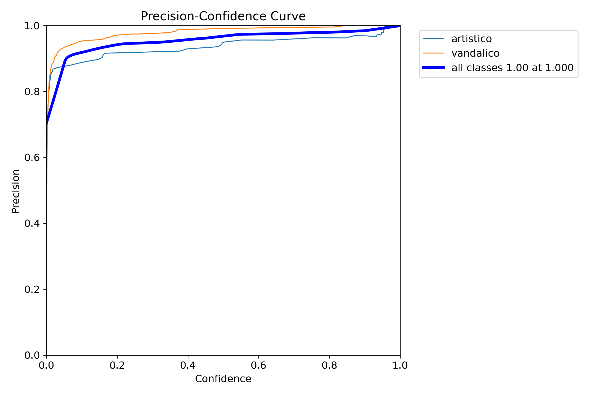
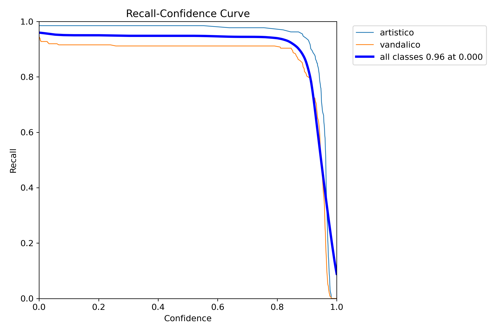
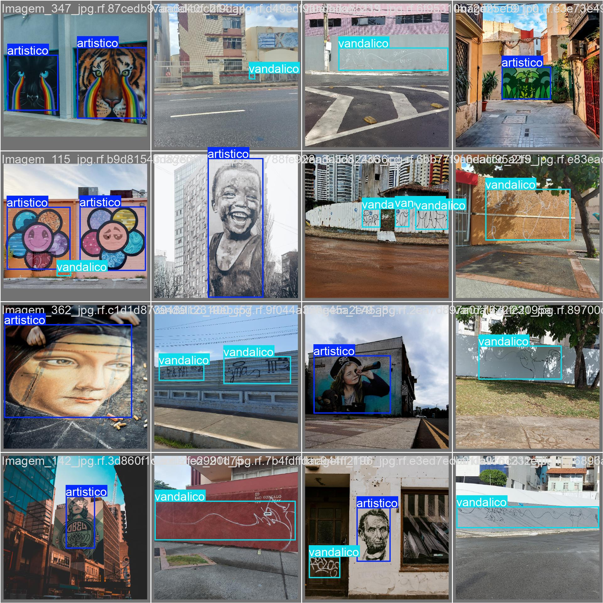
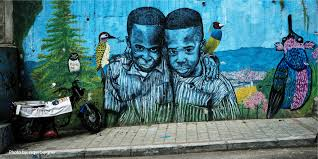
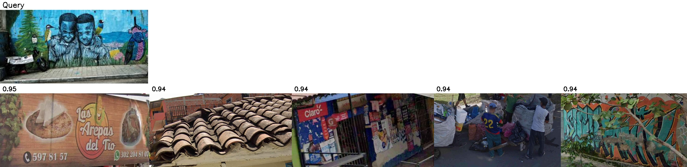
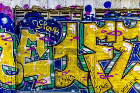
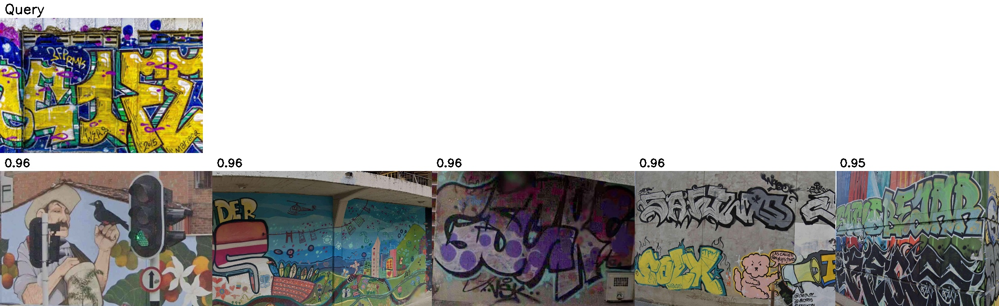

# Resultados del Modelo de Detección de Graffiti

Este informe documenta los resultados de evaluación del modelo YOLOv8 entrenado para detectar graffiti artístico y vandálico en imágenes de calles de Medellín.

---

## 1. Evaluación de Métricas del Modelo

### 1.1 Matriz de Confusión

**Análisis:** El modelo demuestra una capacidad robusta para distinguir entre las clases:

- Para la clase **artístico**, el modelo predijo correctamente la gran mayoría de instancias (133 predicciones correctas).
- Para la clase **vandálico**, el desempeño es igualmente sólido con 228 predicciones correctas.
- **Errores:** Los errores de clasificación cruzada son mínimos (muy pocos "artísticos" confundidos con "vandálicos" y viceversa). La mayor fuente de error proviene de confundir el fondo (background) con graffitis, aunque estos números (17 y 7) siguen siendo bajos en comparación con los aciertos.

---

### 1.2 Curvas de Rendimiento

Las siguientes curvas muestran el comportamiento del modelo en diferentes métricas:

| Precisión (P) | Recall (R) |
|---------------|------------|
|  |  |

| Precision-Recall | F1 Score |
|------------------|----------|
|  |  |

**Análisis de Curvas:**

- **Precision-Recall:** El modelo alcanza un **mAP@0.5 de 0.966** para todas las clases, lo cual indica una precisión excelente. Desglosado, la clase "artístico" tiene una precisión ligeramente superior (0.980) comparada con la "vandálica" (0.952).
- **F1 Score:** La curva de F1 muestra que el equilibrio óptimo entre precisión y exhaustividad (recall) se logra con un umbral de confianza de aproximadamente **0.743**, alcanzando un puntaje de **0.95**. Esto sugiere que el modelo es muy confiable sin ser excesivamente restrictivo.

---

### 1.3 Predicciones en Lote de Validación

Comparación entre las etiquetas reales (ground truth) y las predicciones del modelo:

| Ground Truth (Labels) | Predicciones |
|-----------------------|--------------|
|  |  |

**Observaciones:**

- Al comparar las etiquetas reales (Ground Truth) con las inferencias del modelo, se observa una **coincidencia casi perfecta** en la localización de las cajas delimitadoras (bounding boxes).
- El modelo es capaz de detectar **múltiples instancias en una sola imagen** y diferenciar correctamente los estilos visuales, validando los números vistos en la matriz de confusión.

---

## 2. Prueba de Búsqueda por Similitud

El sistema implementa una búsqueda de imágenes similares con un umbral de confianza de **0.8**, útil para agrupar estilos o encontrar graffitis recurrentes.

### 2.1 Caso de Prueba A: Mural de rostros (`a.jpeg`)

**Imagen de consulta (Query):**

**Análisis:**
- El sistema encontró 5 imágenes con una similitud visual muy alta, oscilando entre **0.9378** y **0.9493**.
- Aunque las imágenes recuperadas no son idénticas al "query", comparten características de textura y color (tonos tierra y urbanos), lo que indica que el algoritmo de embedding está capturando correctamente la estética general de la escena.

**Top 5 graffitis similares encontrados:**

| Rank | Imagen | Similitud | Ubicación |
|------|--------|-----------|-----------|
| 1 | `crop_6.319...det2330.jpg` | **0.9493** | [📍 Ver en Maps](https://www.google.com/maps?q=6.319314791381252,-75.56261645473094) |
| 2 | `crop_6.188...det473.jpg` | **0.9445** | [📍 Ver en Maps](https://www.google.com/maps?q=6.188287856503413,-75.61721935409665) |
| 3 | `crop_6.250...det1579.jpg` | **0.9433** | [📍 Ver en Maps](https://www.google.com/maps?q=6.2506318616317,-75.54341285447681) |
| 4 | `crop_6.228...det612.jpg` | **0.9404** | [📍 Ver en Maps](https://www.google.com/maps?q=6.228742622749679,-75.58721555961158) |
| 5 | `crop_6.236...det644.jpg` | **0.9378** | [📍 Ver en Maps](https://www.google.com/maps?q=6.236293786493595,-75.58547119707686) |

**Visualización completa:**

---

### 2.2 Caso de Prueba B: Graffiti estilo "Wildstyle" (`b.jpeg`)

**Imagen de consulta (Query):**

**Análisis:**
- Este caso muestra un desempeño incluso superior al anterior, con puntuaciones de similitud por encima de **0.95** y llegando hasta **0.9646**.
- El sistema recuperó otros graffitis con densidades visuales, complejidades de trazo y paletas de colores similares, confirmando la eficacia del motor de búsqueda para patrones abstractos.

**Top 5 graffitis similares encontrados:**

| Rank | Imagen | Similitud | Ubicación |
|------|--------|-----------|-----------|
| 1 | `crop_6.153...det234.jpg` | **0.9646** | [📍 Ver en Maps](https://www.google.com/maps?q=6.15362924083733,-75.61274891940629) |
| 2 | `crop_6.255...det766.jpg` | **0.9579** | [📍 Ver en Maps](https://www.google.com/maps?q=6.255162288566859,-75.59044133244417) |
| 3 | `crop_6.255...det764.jpg` | **0.9577** | [📍 Ver en Maps](https://www.google.com/maps?q=6.255032363655146,-75.6123434540198) |
| 4 | `crop_6.250...det707.jpg` | **0.9573** | [📍 Ver en Maps](https://www.google.com/maps?q=6.250557402361707,-75.60357807713433) |
| 5 | `crop_6.203...det876.jpg` | **0.9513** | [📍 Ver en Maps](https://www.google.com/maps?q=6.203635537964823,-75.57874144124726) |

**Visualización completa:**

---

## 3. Conclusiones Generales

### ✅ Alta Precisión de Clasificación
El modelo YOLOv8 ha sido entrenado exitosamente para detectar y clasificar correctamente graffitis artísticos y vandálicos en imágenes de Street View, con **métricas de precisión superiores al 95%**.

### ✅ Eficacia en Búsqueda Visual
El sistema de búsqueda por similitud es robusto, logrando encontrar graffitis visualmente relacionados con **puntuaciones de confianza consistentemente altas** (superiores a 0.93).

### ✅ Utilidad Geoespacial
La integración de coordenadas GPS añade un valor significativo, permitiendo no solo la detección visual sino la **ubicación geográfica precisa** de cada hallazgo para su mapeo.

---

## 4. Trabajo Realizado

Este proyecto incluyó el desarrollo de múltiples componentes para la detección, clasificación y análisis de graffiti urbano:

### 4.1 Entrenamiento del Modelo
- **`entrenamiento-del-modelo.ipynb`**: Notebook con el proceso completo de entrenamiento del modelo YOLOv8.
- **`merge_datasets.py`**: Script para combinar múltiples datasets de graffiti.
- **`filter_training_images.py`**: Filtrado y preparación de imágenes para entrenamiento.

### 4.2 Inferencia y Detección
- **`inference_script.py`**: Script principal para ejecutar detección en imágenes de Street View.
- **`crop_graffiti.py`**: Extracción automática de recortes de graffiti detectados.

### 4.3 Sistema de Embeddings y Similitud
- **`generate_embeddings.py`**: Generación de embeddings vectoriales para búsqueda por similitud.
- **`find_similar_graffiti.py`**: Búsqueda de graffitis visualmente similares usando distancia coseno.
- **`research_embedding.py`**: Investigación y experimentación con embeddings.

### 4.4 Visualización y Aplicación Web
- **`app.py`**: Aplicación Streamlit para búsqueda interactiva de graffitis similares con mapa.
- **`visualize_map.py`**: Visualización de detecciones en mapa interactivo con Folium.
- **`visualize_classes.py`**: Visualización de distribución de clases detectadas.

### 4.5 Documentación y Reportes
- **`INFORME_RESULTADOS.md`**: Este informe con análisis completo de resultados.
- **`convert_md_to_pdf.py`**: Generador de PDF a partir del informe Markdown.
- **`README.md`**: Documentación general del proyecto.

### 4.6 Datos y Modelos
- **`model/best.pt`**: Modelo YOLOv8 entrenado para detección de graffiti.
- **`model/test_results/`**: Métricas y curvas de evaluación del modelo.
- **`test_images/`**: Imágenes de prueba para validación del sistema.
