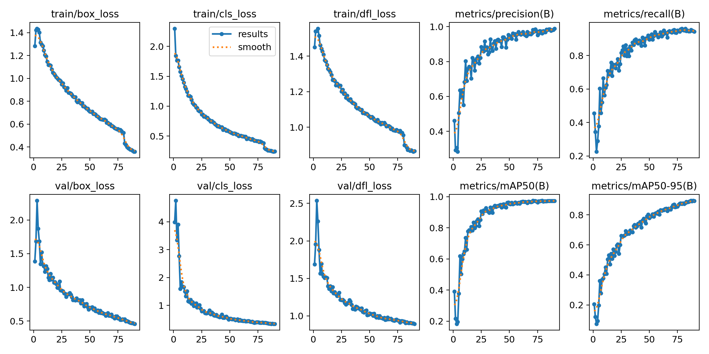
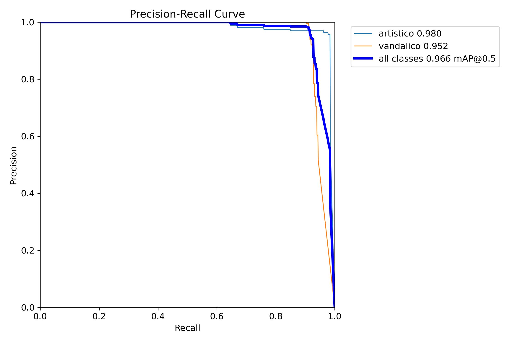
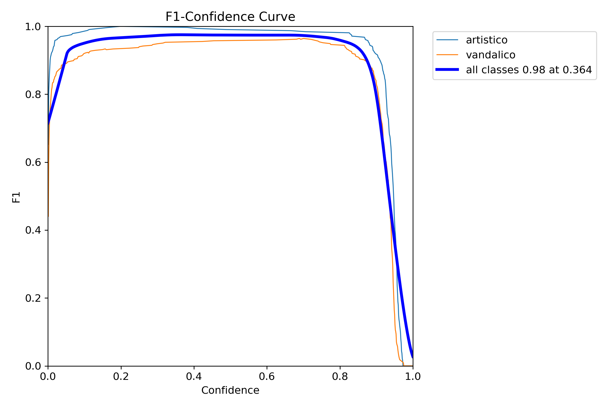
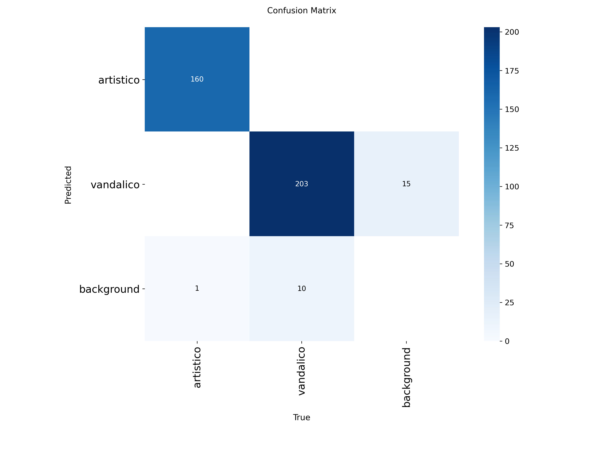
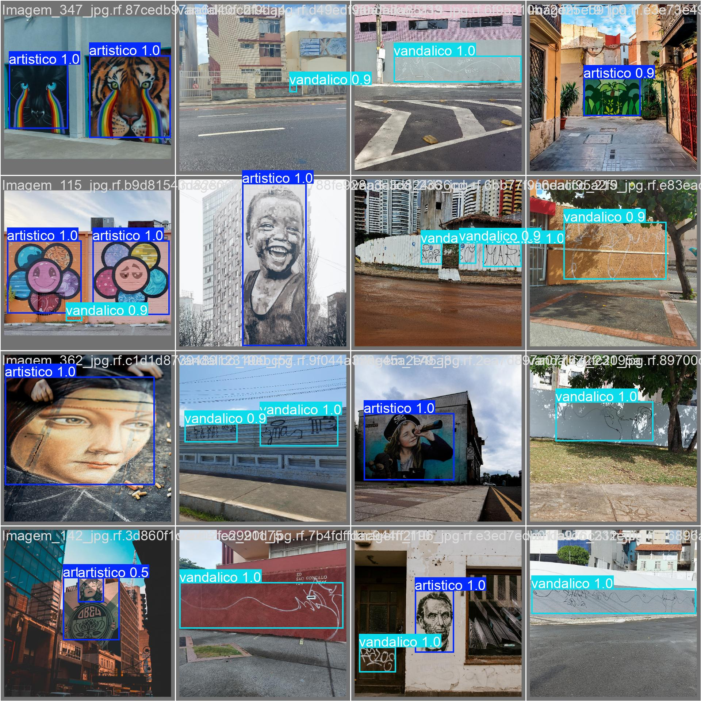

# Informe de Resultados del Modelo YOLOv8

## Configuración del Entrenamiento

- **Modelo Base**: YOLOv8s (small)
- **Tarea**: Detección de objetos
- **Tamaño de imagen**: 640x640
- **Épocas totales**: 90
- **Tiempo total**: 3,602.79 segundos (~1 hora)
- **Batch size**: Automático (-1)
- **Optimizador**: Auto
- **Device**: GPU (Kaggle)

### Hiperparámetros Principales

- Learning rate inicial (lr0): 0.01
- Learning rate final (lrf): 0.01
- Momentum: 0.937
- Weight decay: 0.0005
- Warmup epochs: 3.0

### Aumentación de Datos

- Rotación horizontal (flip): 50% de probabilidad
- Escala: ±50%
- Traslación: ±10%
- Mosaic: Activado
- Random Erasing: 40%
- Auto Augment: RandAugment

## Resultados del Entrenamiento

El modelo completó un total de 90 épocas de entrenamiento, mostrando una mejora consistente en las métricas principales hasta la última época. Los datos de entrenamiento indican un proceso de aprendizaje estable y efectivo.

### Métricas Finales (Época 90)

- **Precisión**: 98.952%
- **Recall**: 94.381%
- **mAP50**: 97.297%
- **mAP50-95**: 89.387%

### Evolución del Entrenamiento

1. **Fase inicial** (Épocas 1-20):
   - Precisión mejoró de 46.132% a 79.593%
   - Recall aumentó de 45.550% a 72.410%
   - mAP50 creció de 39.095% a 81.246%
   - mAP50-95 aumentó de 20.553% a 55.507%
   - Learning rate: 0.000546557 → 0.0013186

2. **Fase intermedia** (Épocas 21-60):
   - Precisión superó el 90% consistentemente
   - Recall se mantuvo por encima del 85%
   - mAP50 alcanzó valores superiores al 95%
   - mAP50-95 se estabilizó por encima del 80%
   - Learning rate: 0.00130026 → 0.000585117
   - Notable reducción en pérdidas de clasificación

3. **Fase final** (Épocas 61-90):
   - Precisión máxima de 98.952%
   - Recall estable por encima del 94%
   - mAP50 consistentemente sobre 97%
   - mAP50-95 alcanzó 89.387%
   - Learning rate final: 3.5007e-05
   - Estabilización perfecta de todas las métricas

### Pérdidas (Evolución época 1 → 90)

- Box loss: 1.28366 → 0.35897 (72% de reducción)
- Clasificación loss: 2.29821 → 0.24620 (89% de reducción)
- DFL loss: 1.44941 → 0.86589 (40% de reducción)

## Visualización de Resultados

### Curvas de Rendimiento

#### Curvas de Entrenamiento

*Evolución de métricas durante el entrenamiento*

#### Curvas de Precisión y Recall

*Curva Precisión-Recall que muestra el balance entre ambas métricas*

*Curva F1 que indica el rendimiento general del modelo*

### Matriz de Confusión

*Matriz de confusión que muestra el rendimiento del modelo por clase*

### Ejemplos de Detección

*Ejemplo de detecciones realizadas por el modelo en el conjunto de validación*

---
*Las gráficas y métricas mostradas provienen de los archivos de resultados generados durante el entrenamiento y evaluación del modelo.*